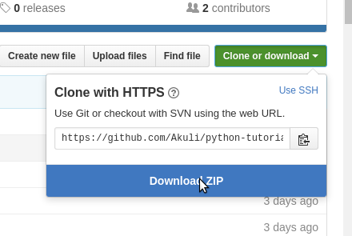

# Python programming tutorial

Python is a high-level programming language. That means that it's easy
to learn and work with, so it's a great choice for a first programming
language.

No tutorial is good for everyone. This one is aimed at people with no
programming experience at all or very little programming experience. If
you have programmed a lot in the past using some other language you
probably want to read
[the official tutorial](https://docs.python.org/3/tutorial/) instead.

This tutorial was written in Python 3, and you need Python 3 or newer to
be able to run the example code yourself. Python 2 is getting outdated
all the time, and more and more projects are moving to Python 3. There
are a few popular libraries that don't support Python 3 that well at the
time of writing this, but you don't need to worry about that just yet.
They will probably support Python 3 by the time you've learned the
basics and you may actually need them.

I have tested most of the code in this tutorial on Python 3.4, but
everything should also work on Python 3.3, 3.2 and all newer Pythons.

## List of contents

The tutorial consists of two sections:

### Basics

This section will get you started with using Python and you'll be able 
to learn more about whatever you want after studying it.

1. [What is programming?](basics/what-is-programming.md)
2. [Installing Python](basics/installing-python.md)
3. [Getting started with Python](basics/getting-started.md)
4. [ThinkPython: The way of the program](basics/the-way-of-the-program.md)
5. [Variables, Booleans and None](basics/variables.md)
6. [Using functions](basics/using-functions.md)
7. [If, else and elif](basics/if.md)
8. [Handy stuff with strings](basics/handy-stuff-strings.md)
9. [Lists and tuples](basics/lists-and-tuples.md)
10. [Loops](basics/loops.md)
11. [Trey Hunner: zip and enumerate](basics/trey-hunner-zip-and-enumerate.md)
12. [Dictionaries](basics/dicts.md)
13. [Defining functions](basics/defining-functions.md)
14. [What is true?](basics/what-is-true.md)
15. [Files](basics/files.md)
16. [Exceptions](basics/exceptions.md)
17. [Modules](basics/modules.md)
18. [Classes](basics/classes.md)

### Advanced

If you want to learn more advanced techniques, you can also read this 
section. Most of the techniques explained here are great when you're 
working on a large project, and your code would be really repetitive 
without these things.

You can experient with these things freely, but please **don't use these 
techniques just because you know how to use them.** Prefer the simple 
techniques from the Basics part instead when possible. Simple is better 
than complex.

1. [Magic methods](advanced/magicmethods.md)
2. [Iterables and iterators](advanced/iterators.md)

### Other things this tutorial comes with

- **Important:** [getting help](getting-help.md)
- [Contact me](contact-me.md)
- [Setting up a text editor](editor-setup.md)
- Answers for excercises in [basics](basics/answers.md) and
    [advanced](advanced/answers.md) sections
- [The TODO list](TODO.md)

## How to read this tutorial without an internet connection

1. Go [here](https://github.com/Akuli/python-tutorial) if you aren't
    here already.
2. Click the big green "Clone or download" button in the top right of
    the page, then click "Download ZIP".

    

3. Extract the ZIP and open it. Unfortunately I don't have any more
    specific instructions because how exactly this is done depends on
    which operating system you run.
4. Run `make-html.py` and follow the instructions.

If you have git and you know how to use it, you can also clone the
repository instead of downloading a zip and extracting it. An advantage
with doing it this way is that you don't need to download the whole
tutorial again to get the latest version of it, all you need to do is to
pull with git and run `make-html.py` again.

## Authors

I'm Akuli and I have written most of this tutorial, but these people
have helped me with it:
- [SpiritualForest](https://github.com/SpiritualForest): Lots of typing
    error fixes.
- [theelous3](https://github.com/theelous3): Small improvements and fixes.

***

You may use this tutorial at your own risk. See [LICENSE](LICENSE).
