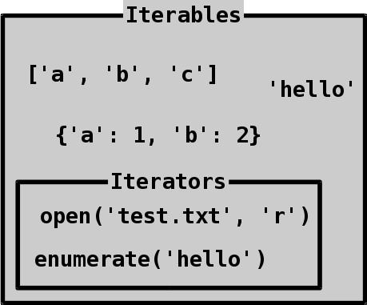

# Iterables and iterators

So far we have used for loops with many different kinds of things.

```py
>>> for name in ['theelous3', 'RubyPinch', 'go|dfish']:
...     print(name)
... 
theelous3
RubyPinch
go|dfish
>>> for letter in 'abc':
...     print(letter)
... 
a
b
c
>>> 
```

For looping over something is one way to **iterate** over it. Some other 
things also iterate, for example, `' '.join(['a', 'b', 'c'])` iterates 
over the list `['a', 'b', 'c']`. If we can for loop over something, then 
that something is **iterable**. For example, strings and lists are 
iterable, but integers and floats are not.

```py
>>> for thing in 123:
...     print(thing)
... 
Traceback (most recent call last):
  File "<stdin>", line 1, in <module>
TypeError: 'int' object is not iterable
>>> 
```

## Iterators

Lists and strings don't change when we iterate over them.

```py
>>> word = 'hi'
>>> for character in word:
...     print(character)
... 
h
i
>>> word
'hello'
>>> 
```

We can also iterate over [files](../basics/files.md), but they change 
when we do that. They remember their position, so if we iterate over 
them twice we get the content once only.

```py
>>> with open('test.txt', 'w') as f:
...     print("one", file=f)
...     print("two", file=f)
... 
>>> a = []
>>> b = []
>>> with open('test.txt', 'r') as f:
...     for line in f:
...         a.append(line)
...     for line in f:
...         b.append(line)
... 
>>> a
['one\n', 'two\n']
>>> b
[]
>>> 
```

We have also used [enumerate](../basics/trey-hunner-zip-and-enumerate.md)
before, and it actually remembers its position also:

```py
>>> e = enumerate('hello')
>>> for pair in e:
...     print(pair)
... 
(0, 'h')
(1, 'e')
(2, 'l')
(3, 'l')
(4, 'o')
>>> for pair in e:
...     print(pair)
... 
>>> 
```

Iterators are **iterables that remember their position**. For example, 
`open('test.txt', 'r')` and `enumerate('hello')` are iterators. 
Iterators can only be used once, so we need to create a new iterator if 
we want to do another for loop.

Here's a picture that hopefully explains this better:



## Iterating manually

Iterators have a magic method called `__next__`, and there's a built-in 
function called `next()` for calling that. Calling `next()` on an 
iterator gets the next value and moves it forward. Like this:

```py
>>> e = enumerate('abc')
>>> e.__next__()
(0, 'a')
>>> e.__next__()
(1, 'b')
>>> e.__next__()
(2, 'c')
>>> 
```

There's also a built-in `next()` function that does the same thing:

```py
>>> e = enumerate('abc')
>>> next(e)
(0, 'a')
>>> next(e)
(1, 'b')
>>> next(e)
(2, 'c')
>>> 
```

Here `e` remembers its position, and every time we call `next(e)` it 
gives us the next element and moves forward. When it has no more values 
to give us, calling `next(e)` raises a StopIteration:

```py
>>> next(e)
Traceback (most recent call last):
  File "<stdin>", line 1, in <module>
StopIteration
>>> 
```

There is usually not a good way to check if the iterator is at the end, 
and it's best to just try to get an value from it and catch 
StopIteration.

This is actually what for looping over an iterator does. For example, 
this code...

```py
for pair in enumerate('hello'):
    print(pair)
```

...does roughly the same thing as this code:

```py
e = enumerate('hello')
while True:
    try:
        pair = next(e)
    except StopIteration:
        # it's at the end, time to stop
        break
    # we got a pair
    print(pair)
```

The for loop version is much simpler to write and I wrote the while loop 
version just to explain what the for loop does.

## Converting to iterators

Now we know what iterating over an iterator does. But how about 
iterating over a list or a string? They are not iterators, so we can't 
call `next()` on them:

```py
>>> next('abc')
Traceback (most recent call last):
  File "<stdin>", line 1, in <module>
TypeError: 'str' object is not an iterator
>>> 
```

There's a built-in function called `iter()` that converts anything 
iterable to an iterator.

```py
>>> i = iter('abc')
>>> i
<str_iterator object at 0x7f987b860160>
>>> next(i)
'a'
>>> next(i)
'b'
>>> next(i)
'c'
>>> next(i)
Traceback (most recent call last):
  File "<stdin>", line 1, in <module>
StopIteration
>>> 
```

Calling `iter()` on anything non-iterable gives us an error.

```py
>>> iter(123)
Traceback (most recent call last):
  File "<stdin>", line 1, in <module>
TypeError: 'int' object is not iterable
>>> 
```

If we try to convert an iterator to an iterator using `iter()` we just 
get back the same iterator.

```py
>>> e = enumerate('abc')
>>> iter(e) is e
True
>>> 
```

So code like this...

```py
for thing in stuff:
    print(thing)
```

...works roughly like this:

```py
iterator = iter(stuff)
while True:
    try:
        thing = next(iterator)
    except StopIteration:
        break
    print(thing)
```

## Custom iterables

Implementing a custom iterator is easy. All we need to do is to define a 
`__next__` method that gets the next element, and an `__iter__` method 
that returns the iterator itself. For example, here's an iterator that
behaves like `iter([1, 2, 3])`:


***

You may use this tutorial freely at your own risk. See
[LICENSE](../LICENSE).

[Previous](../basics/classes.md) | [Next](../README.md) |
[List of contents](../README.md#advanced)
