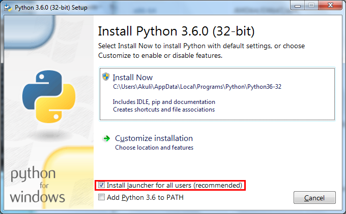

# Installing Python

If you want to learn to program with Python using this tutorial, you
need to try out the code examples. You can use a website like
[repl.it](https://repl.it/languages/python3), but I highly recommend
installing Python. That way you don't need to open a web browser just
to write code, and you can work without an Internet connection.

It doesn't matter which operating system you use because Python runs
great on Windows, Mac OSX, Linux and many other operating systems.
However, installing and launching Python are done differently on
different operating systems, so just follow your operating system's
instructions.

Let's get started!

## Downloading and installing Python

### Windows

Installing Python on Windows is a lot like installing any other program.

1. Go to [the official Python website](https://www.python.org/).
2. Move your mouse over the blue Downloads button, but don't click it.
   Then click the button that downloads the latest version of Python.
3. Run the installer.
4. Make sure that the launcher gets installed and click Install Now.

    

### Mac OSX

At the time of writing this, Macs don't come with a Python 3 and you
need to install it yourself. It should be like installing any other
program, but unfortunately I don't have better instructions because I
don't have an up-to-date Mac and I have never installed Python on a Mac.
If you would like to write better instructions, [tell
me](../contact-me.md).

### Linux

You already have Python 3, **there's no need to install anything**. You
may also have Python 2, but don't try to remove it. Some of your
programs are probably written in Python 2, so removing Python 2 would
break them.

## Running Python

Next we'll learn to use the Python we just installed.

### Windows

1. Open a PowerShell from your start menu or start screen.
2. Type `py` and press Enter. You should see something like this:

    

### Other operating systems

1. Open a terminal. How exactly this is done depends on your operating
    system, but most operating systems have some way to search for
    programs. Search for a program called terminal and launch it.
2. Type `python3` and press Enter. You should see something like this:

    

    Your terminal probably looks different than mine, it's OK.

Go ahead and write `print("Hello World!")` after the `>>>`, and then
press Enter, and Python will respond with a classic greeting :)

When you're done type `exit()` and press Enter to get out of Python, and
then close the terminal or PowerShell window.

## The Editor

Python starts into a handy `>>>` prompt by default, and it's awesome for
trying out how things work. But programmers spend most of their time
writing **programs** into files instead of just writing little pieces of
code on a prompt.

An **editor** lets you save code to files. There are many editors, and
the choice of editor is a very personal thing. Each programmer has their
own favorite editor that they tend to recommend to everyone. If you
already know which editor you want to use, just [set it up](editor-setup.md)
and [skip the rest of this chapter](#summary). Otherwise keep reading.

Your computer probably came with an editor, but it probably lacks lots
of important features because it isn't meant to be used for programming
and you need a better editor. For example, Windows comes with Notepad
but it's lacking many important features that make writing Python code
easier. Python also comes with its own editor called IDLE, but it also
lacks a few features (even though it's better than Notepad).

I recommend [Porcupine](https://github.com/Akuli/porcupine/blob/master/README.md)
because I made it and it's easy to use. **[Click here to install
it.](https://github.com/Akuli/porcupine/wiki/Installing-and-Running-Porcupine)**

## Using the Editor

*__Note:__ This section assumes that you use Porcupine. You may need to
do something differently if you use another editor.*

Open your editor and press *Ctrl+N* create a new file in it. Then save
it with *Ctrl+S* and choose whatever folder you want. The file name can
be anything you want, but **it must end with `.py`**. For example,
`wat.py` is OK but `lolz` is not. This way your editor knows that you
want to create a python file.

Now type this code into the editor:

```python
print("Hello World")
print("Testing... 1 2 3")
print("Goodbye")
```

You should see something like this:


Press *Ctrl+S* again to save the file (this time the editor remembers
where it is and you don't need to choose a location and filename again).
Then press *F5* to run the code. As you can see, it simply runs line by
line, top to bottom.

## Summary

- Now you should have Python installed, and you should be able run its
  `>>>` prompt.
- You should also have an editor that lets you write code to files and
  run the code.

***

If you have trouble with this tutorial please [tell me about
it](../contact-me.md) and I'll make this tutorial better. If you
like this tutorial, please [give it a
star](../README.md#how-can-i-thank-you-for-writing-and-sharing-this-tutorial).

You may use this tutorial freely at your own risk. See
[LICENSE](../LICENSE).

[Previous](what-is-programming.md) | [Next](getting-started.md) |
[List of contents](../README.md#basics)
