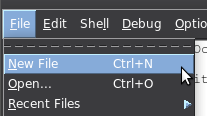

# 4. Using if, elif, else and while

### Using if statements

Now we know what True and False are.

```py
>>> 1 == 1
True
>>> 1 == 2
False
>>>
>>> its_raining = True
>>> its_raining
True
>>>
```

But what if we want to execute different code depending on something?
That's when `if` comes in.

```py
>>> its_raining = True
>>> if its_raining:
...     print("It's raining!")
... 
It's raining!
>>> its_raining = False
>>> if its_raining:
...     print("It's raining!")        # nothing happens
... 
>>> 
```

The prompt changed from `>>>` to `...`. It meant that Python was
expecting me to keep typing. When I was done, I just pressed Enter
twice. My code was execute and the prompt was restored to `>>>`.

At this point it's easier to put your code into a file and use it
there. If you use IDLE, go to File at top left and select New File, or
just press Ctrl+N.



If you are not using IDLE, open whatever editor you have installed, or
install

The file's content would be like this:

```py
its_raining = True
if its_raining:
    print("It's raining!")
```

### Using else

What if you want to print a different message if it's not raining? You could do something like this:

```py
its_raining = True                  # you can change this to False
its_not_raining = not its_raining   # False if its_raining, True otherwise

if its_raining:
    print("It's raining!")
if its_not_raining:
    print("It's not raining.")
```

Now your program will print a different value depending on what the value of `its_raining` is.

You can also add `not its_raining` directly to the second if statement:

```py
its_raining = True

if its_raining:
    print("It's raining!")
if not its_raining:
    print("It's not raining.")
```

But you can make it even better by using `else`.

```py
its_raining = True

if its_raining:
    print("It's raining!")
else:
    print("It's not raining.")
```

By combining that with the input function we can make a program that asks for a password and checks if it's correct.

```py
print("Hello!")
password = input("Enter your password: ")

if password == "secret":
    print("That's correct, welcome!")
else:
    print("Access denied.")
```

The program prints different things depending on what you enter.

    >>> ================================ RESTART ================================
    >>>
    Hello!
    Enter your password: secret
    Welcome!
    >>> ================================ RESTART ================================
    >>>
    Hello!
    Enter your password: lol
    Access denied.
    >>>

Using the input function for passwords doesn't work very well because we can't hide the password with asterisks. There are better ways to get a password from the user, but you shouldn't worry about that just yet.

### Avoiding many levels of indentation with elif

If you have more than one condition to check, your code will end up looking a bit messy.

```py
print("Hello!")
word = input("Enter something: ")

if word == "hi":
    print("Hi to you too!")
else:
    if word == "hello":
        print("Hello hello!")
    else:
        if word == "howdy":
            print("Howdyyyy!")
        else:
            if word == "hey":
                print("Hey hey hey!")
            else:
                if word == "gday m8":
                    print("Gday 4 u 2!")
                else:
                    print("I don't know what", word, "means.")
```

Instead of typing `else`, indenting more and typing an `if` you can simply type `elif`, which is short for `else if`. Like this:

```py
print("Hello!")
word = input("Enter something: ")

if word == "hi":
    print("Hi to you too!")
elif word == "hello":
    print("Hello hello!")
elif word == "howdy":
    print("Howdyyyy!")
elif word == "hey":
    print("Hey hey hey!")
elif word == "gday m8":
    print("Gday 4 u 2!")
else:
    print("I don't know what", word, "means.")
```

### Repeating with while loops

While loops are similar to if statements. The only difference is that at the end of the indented block they go back to the line with the word `while` and the condition.

```py
its_raining = True
while its_raining:
    print("It's raining!")
    # We'll jump back to the second line from here
```

Don't get scared when you run the program. Like I wrote in the introduction, this will not destroy or crash your computer. It just repeats the same thing quickly. You can interrupt the program by hitting Ctrl+C. You'll get an error message saying that a `KeyboardInterrupt` occurred, that's normal. The output is like this:

    >>> ================================ RESTART ================================
    >>>
    It's raining!
    It's raining!
    It's raining!
    It's raining!
    It's raining!
    It's raining!
    It's raining!
    (many more lines of raining)

What happened is that the indented while block ran, just like an if block. Then, at the end of the block we moved back to the beginning of the while loop. `its_raining` was still `True`, so the indented block ran again, and so on.

While loops are often used for repeating things forever _[*]_ with a `while True`.

```py
while True:
    answer = input("Is it still raining? (y/n) ")
    if answer == "y":
        print("It's raining!")
    elif answer == "n":
        print("It's not raining.")
    else:
        print("Please enter 'y' or 'n'.")
```

Again, you can interrupt the program with Ctrl+C.

_[*] There are many ways to interrupt while loops, including `while True` loops. `break` will end the innermost loop it's in, and `exit()` will quit the whole program._

### Exercises
1. Make a program that asks for a password and prints `Welcome!`, `Access denied` or `You didn't enter anything` depending on whether the user entered the correct password, a wrong password, or nothing at all by pressing Enter without typing anything.
2. Make a program that asks for username and password and checks them. Make users "foo" and "bar" with passwords "biz" and "baz".
3. Make a program that asks for username and password and gives the user an infinite number of attempts, so the user can always try again if he mistypes the password.
4. Can you limit the number of attempts to 3?

The answers are [here](answers.md).

[Previous](3.md) | [Next](5.md) | [Home](README.md)
